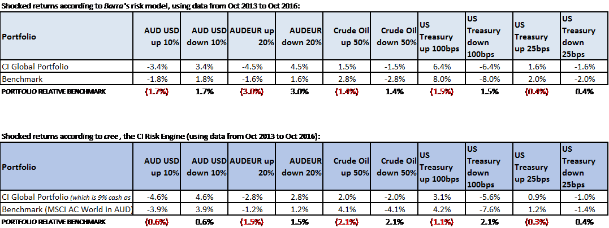

```{r setup, include=FALSE}
knitr::opts_chunk$set(echo = FALSE)
source('main_AU.R', echo = FALSE)
source('report_chart_PCHEST_factor_model_results_over_time.R', echo = FALSE)
source('bond_vs_bmark_ts_au.R', echo = FALSE)
source('history_of_shock_forecasts_au.R', echo = FALSE)
```
## What is the _Interest Rate Shock Model_?
<!-- Remember, you can render this in Visual Studio by going:
	rmarkdown::render('preso.Rmd')
at the command line.  In practice, these presos are easier to work on from RStudio, which has more point-and-click features for "knitting"" and compiling single blocks. -->
> "All models are wrong but some are useful" 
> --- George Box (English statistician)

Start with a multi factor model with only two factors, being the benchmark equity index ($B$) and the bond index ($F$ for fixed income):
$$r_t = \alpha + \beta_B r_{B,t} + \beta_F r_{F,t} + \theta_t$$
<!-- (The $\theta_t$ is a residual term which we assume will always average out to zero.  The $\alpha$ ought to be very close to zero.)  --> 
For every stock, I run a **multilinear regression** using three years of weekly historic data to determine the values of $\alpha$, $\beta_B$ and $\beta_F$. The result is a simple linear model: plug in returns of the two factors to get an estimated return of the stock. 

To build a complete _Interest Rate Shock Model_, we use simpler 1-factor models to estimate how yield changes affect the benchmark and bond returns, then plug those estimates into the above equation.

## The factors and the shock parameter for AU
For the benchmark, use the _S&P/ASX 200_ total return index.

For the yield, use the yield to maturity of _Australia Benchmark Bond - 10 Year_ (FactSet ticker _TRYAU10Y-FDS_).  When I shock the yield (by increasing it by 100 bp), I actually compute the log return of the latest yield:
$$log(`r round(1 + yield_index[nrow(yield_index),1], 2)`\%) - log(`r round(yield_index[nrow(yield_index),1], 2)`\%) =
`r round(log(1 + yield_index[nrow(yield_index),1]) - log(yield_index[nrow(yield_index),1]), 4)`$$
is the "return of the yield" shock.  I use this to estimate the shocked returns of the benchmark and bond index.

For the bond, use the total return of the _Citigroup Australian Broad Investment-Grade Bond Index_. Northfield tends to use Citigroup fixed-income indices, and for this yield I find the correlation to be very good (see next page).

## How yield affects bond index returns
_Returns of the yield_ are highly correlated to bonds:

```{r bond-yield regression, echo=FALSE, fig.height=5}
show_regression_between_xts(periodReturn(bond_index, period = freq_long_form), periodReturn(yield_index, period = freq_long_form, type = 'log'), "bond", "yield")
```
<!-- This chart should look good.  Point out that this is *not* the part of the model we should worry about. -->

## How yield affects benchmark returns
_Don't forget correlation:_  If the bond changes, then the benchmark will change, too:

```{r benchmark-bond regression, echo=FALSE, fig.height=5}
show_regression_between_xts(periodReturn(bmark_index, period = freq_long_form), periodReturn(bond_index, period = freq_long_form), "bmark", "bond")
``` 
<!-- This chart should look bad.  Say:  "This ought to ought to underline the imperfection in the models.  Note that the 'big boy' risk models are no better, drawing 'lines drawn clouds of dots' just like this." -->

## Equities vs fixed income throughout history
Disclaimer:  benchmarks and bonds now have low correlation _(remember:  correlation$^2 = R^2$)_ and are inversely related ($\beta < 0$)

```{r benchmark-bond relationships over time, echo=FALSE, fig.height=6}
ggplot(melted_ts_combo_au, aes(end_date, value)) +
  geom_line() +
  ggtitle("ASX 200 vs Aus Bond Index:  Beta & R-squared (3y monthly rolling)") +
  facet_wrap( ~ metric, ncol = 1, scales = "free_y") +
  theme(legend.position = "bottom") +
  scale_x_date(date_labels = "%Y", date_breaks = "2 years")
```

## Why 3 years weekly?
We tried all timespans from six months to five years, with daily, weekly and monthly frequencies:

```{r pfolio_rel_estimates_over_times, echo=FALSE, fig.height = 6}
ggplot(df_ts_experiment, aes(months, pfolio_return_rel_bmark, colour = frequency)) +
  geom_line() +
  theme(legend.position = "bottom") +
  ggtitle("Next pfolio rel return if yield +100 bp:  model result by timespan and frequency")
```

## Now the results:
I compute this model for each stock in the AEF portfolios (code PCHEST).  Then I shock the 10Y Aus Bond Yield by +100 bps and calculate the estimated return of your portfolio based on latest weights in the database.  I find:

- AEF estimated return = `r paste(round(100 * df_summary["AU 10Y Rate +100bp"],2), "%", sep = "")`.  

- ASX 200 estimated return = `r paste(round(100 * benchmark_returns["AU 10Y Rate +100bp"],2), "%", sep = "")`.  

- Therefore, we estimate AEF would underperform by `r paste(round(100 * (df_summary["AU 10Y Rate +100bp"] - benchmark_returns["AU 10Y Rate +100bp"]),2), "%", sep = "")` in this scenario.

## How the results changed through history

```{r, echo = FALSE}
ggplot(filtered_melted_df, aes(end_date, value, colour = variable)) + geom_line() + ggtitle(paste(pfolio_code, "How shock forecasts changed over time")) + theme(legend.position="bottom")
```

## Other shock models
Similar to the _Interest Rate Factor Model_, I wrote other 2-factor models of the form
$$r_t = \alpha + \beta_B r_{B,t} + \beta_F r_{F,t} + \theta_t$$
where $B$ is the benchmark equity index and the $F$ is another factor.  I've tried changes in _Brent Oil_, various currencies and a USD currency basket index (ticker _DXY-IFUS_ in FactSet).

***Results better viewed in Excel***

## How does this compare to Barra?


<!--.  I find:
* PCGLUF estimated return is +3.0%, while Barra computed +6.4%
* the benchmark estimated returns +4.2%, while Barra computed +8.0%
* My model says -1.2% underperformance, while Barra say -1.6%
-->

## Why so different from other risk models?
The two main differences with a true risk model (by Northfield, Barra or UBS) are:

1. Most risk models use "exponentially decay weighted" observations.  This means history has a half-life, and the model puts more emphasis on recent data than older data.

2. Other risk models have more factors, including:
	+ Sectors (GICS or otherwise)
	+ Regions or countries
	+ Currencies
	+ Oil prices
	+ The usual quant signals (size, Value/Growth, etc)
	+ Some economic signals (IP, Slope of the Term Structure, etc)
